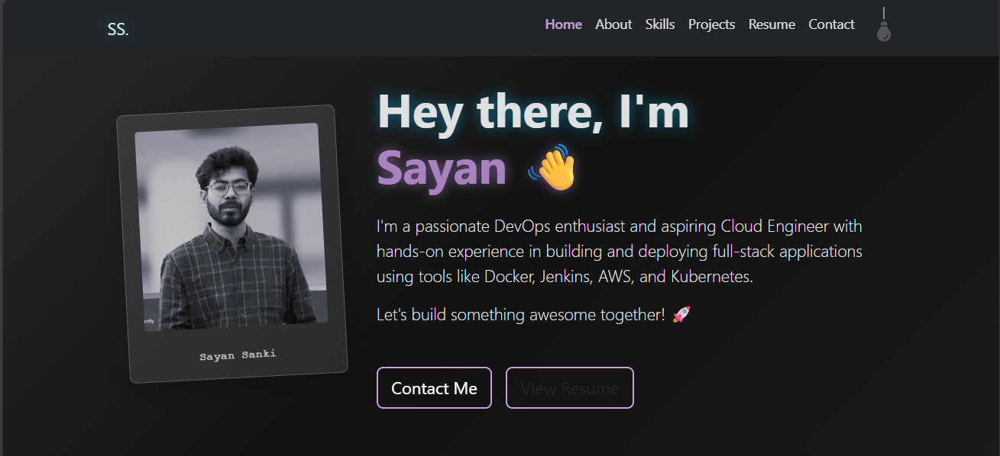

# DevOps Portfolio 🚀

[](https://choosealicense.com/licenses/mit/)
[]


A modern, responsive portfolio website showcasing DevOps skills and projects, built with React and deployed using GitHub Pages with automated CI/CD.



## 🌐 Live Demo

⚠️ Hosted on AWS EC2 using Docker (HTTP).

👉 **Copy & paste into browser**: http://3.111.176.233/

> Note: HTTPS is not enabled to keep infrastructure simple and cost-free.


## ✨ About the Project

This project is a personal portfolio website designed to showcase my skills and experience in DevOps and Cloud Engineering. It's a single-page application built with React, featuring a clean and modern design, with a focus on a great user experience.

The portfolio is fully responsive, and includes sections for an introduction, about me, my skills, projects, resume, and a contact form. It also features a dark/light theme toggle.

## 🛠️ Built With

*   [React](https://reactjs.org/)
*   [React Bootstrap](https://react-bootstrap.github.io/)
*   [Styled Components](https://styled-components.com/)
*   [React Icons](https://react-icons.github.io/react-icons/)
*   [GitHub Actions](https://github.com/features/actions)
*   [Docker](https://www.docker.com/)
*   [Kubernetes](https://kubernetes.io/)
*   [Terraform](https://www.terraform.io/)
*   [AWS](https://aws.amazon.com/)

### Frontend
- React
- React Bootstrap
- Styled Components

### DevOps & Cloud
- Docker
- GitHub Actions (CI/CD)
- AWS EC2
- Nginx

### Learning / Experimental
- Kubernetes (manifests included)
- Terraform (planned)


## 🏗️ Architecture Overview
```
User Browser
|
| HTTP (Port 80)
v
AWS EC2 (Amazon Linux 2023)
|
| Docker
v
Nginx (serving React build)
```
## 🚀 Getting Started

To get a local copy up and running follow these simple example steps.

### Prerequisites

*   Node.js (v18 or higher)
*   npm or yarn
*   Git
*   Docker

### Installation

1.  Clone the repo
    ```sh
    git clone https://github.com/Ssayan1/DevOps_portfolio_v1.git
    ```
2.  Install NPM packages
    ```sh
    cd frontend
    npm install
    ```
3.  Start the development server
    ```sh
    npm start
    ```
4.  Open your browser to `http://localhost:3000`


## 🚀 Deployment

This portfolio is designed to be deployed in various environments:

### GitHub Pages

The `main` branch is automatically deployed to GitHub Pages using a GitHub Actions workflow.

### Docker

You can build and run the portfolio using Docker and Docker Compose:

```sh
docker-compose up -d
```

### Kubernetes

To deploy the portfolio to a Kubernetes cluster, you can use the provided manifest files:

```sh
kubectl apply -f k8s/
```

## 📚 What I Learned

- Containerizing a React application with Docker
- Debugging Docker networking and port bindings
- Deploying containers on AWS EC2
- Configuring Security Groups for public access
- Setting up CI/CD pipelines using GitHub Actions
- Troubleshooting real-world deployment issues


## 🤝 Contributing

Contributions are what make the open source community such an amazing place to learn, inspire, and create. Any contributions you make are **greatly appreciated**.

1.  Fork the Project
2.  Create your Feature Branch (`git checkout -b feature/AmazingFeature`)
3.  Commit your Changes (`git commit -m 'Add some AmazingFeature'`)
4.  Push to the Branch (`git push origin feature/AmazingFeature`)
5.  Open a Pull Request

## 📄 License

Distributed under the MIT License. See `LICENSE` for more information.

## 📞 Contact

Sayan Sanki - sayansanki1997@gmail.com

Project Link: [https://github.com/Ssayan1/DevOps_portfolio_v1](https://github.com/Ssayan1/DevOps_portfolio_v1)
