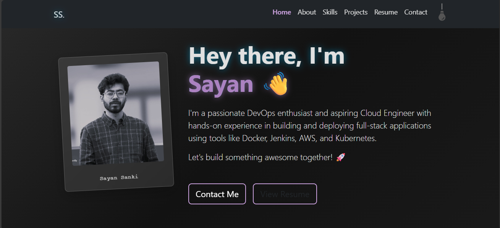

# 🚀 DevOps Portfolio Deployment (AWS + Terraform + CI/CD)

[](https://choosealicense.com/licenses/mit/)


A production-ready React portfolio deployed using **Docker, Kubernetes, and AWS EC2**, with CI/CD automation.



---

## 🌐 Live Demo

👉 **Copy & paste into browser**: https://d61zgekfhvg0k.cloudfront.net/

---

## ✨ About the Project

This project demonstrates a complete DevOps workflow by deploying a React-based portfolio application using:

- Infrastructure as Code (Terraform)
- Cloud hosting on AWS (S3 + CloudFront)
- Automated CI/CD pipeline using GitHub Actions

Every code push triggers an automated deployment pipeline, making the application continuously updated and globally accessible.

---

## 🏗️ Architecture

User → CloudFront (CDN) → S3 (Static Hosting)
↑
GitHub Actions (CI/CD)


---

## 🛠️ Tech Stack

- Cloud: AWS (S3, CloudFront, IAM)
- Infrastructure as Code: Terraform
- CI/CD: GitHub Actions
- Frontend: React.js
- Version Control: Git & GitHub

---

## ⚙️ Features

- ✅ Fully automated CI/CD pipeline
- ✅ Infrastructure provisioned using Terraform
- ✅ Static website hosting on S3
- ✅ Global content delivery via CloudFront
- ✅ Automatic cache invalidation after deployment
- ✅ Scalable and production-ready architecture

---

## 🚀 CI/CD Workflow

1. Developer pushes code to GitHub
2. GitHub Actions triggers workflow
3. React app is built
4. Files are uploaded to S3
5. CloudFront cache is invalidated
6. Updated website is served globally

---

## 📂 Project Structure

```
DevOps-Portfolio/
│
├── frontend/          # React application
├── terraform/         # Terraform infrastructure code
├── .github/workflows/ # CI/CD pipelines
├── docker-compose.yml
└── README.md
```
---

## 🔧 Terraform Setup

Initialize Terraform
```
terraform init
```
Preview Changes
```
terraform plan
```
Apply Infrastructure
```
terraform apply
```
---

## 🔐 GitHub Secrets Required

To enable CI/CD, configure the following secrets:

AWS_ACCESS_KEY_ID
AWS_SECRET_ACCESS_KEY
AWS_REGION
S3_BUCKET
CLOUDFRONT_DISTRIBUTION_ID

---

## 📸 Screenshots

Add screenshots of:

- CloudFront distribution
- S3 bucket
- GitHub Actions success run

---

## 📈 Future Improvements

- 🔐 Secure S3 using Origin Access Control (OAC)
- 🌐 Custom domain with HTTPS (Route53 + ACM)
- 📊 Monitoring with CloudWatch
- 🐳 Containerized deployment using Docker & ECS
- ☸️ Kubernetes (EKS) deployment

---

## 👨‍💻 Author

Sayan Sanki
🔗 GitHub: https://github.com/Ssayan1

---

⭐ If you like this project

Give it a star ⭐ and feel free to fork!
